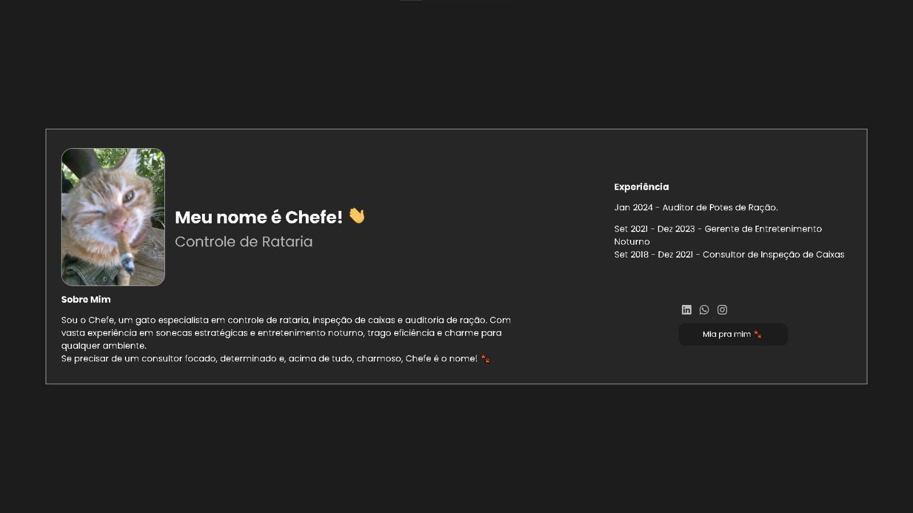
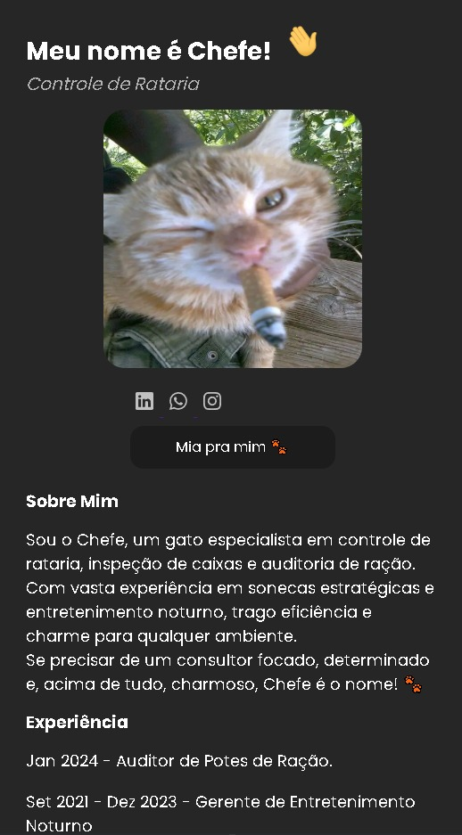

# Portfólio Responsivo Chefe 🐾
Este é um portfólio fictício criado para **Chefe**, um gato especialista em controle de rataria, inspeção de caixas e auditoria de ração. O projeto tem como objetivo demonstrar habilidades adquiridas em front-end, com ênfase em responsividade, organização de código e integração com tecnologias como **HTML5**, **CSS3**, **Sass**, **Normalize.css** e **JavaScript**.


## Capturas de Tela
<div style="display: flex;     text-align: center;">
  
### Desktop


### Mobile

</div>


## Tecnologias Usadas

- **HTML5**: Estrutura básica do conteúdo.
- **CSS3**: Estilização e design do site.
- **Sass**: Para um CSS mais organizado e modular.
- **JavaScript**: Para inserir html.
- **Normalize.css**: Para garantir que o layout seja consistente em diferentes navegadores.
- **Google Fonts**: Utilização das fontes *Poppins* e *Playfair Display*.

## Como Rodar o Projeto

### Passo 1: Clone o Repositório

Clone o repositório para o seu computador:

```bash
git clone https://github.com/usuario/portfolio-chefe.git
